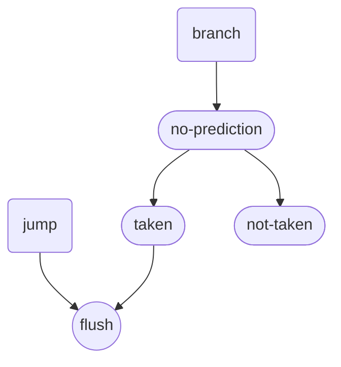
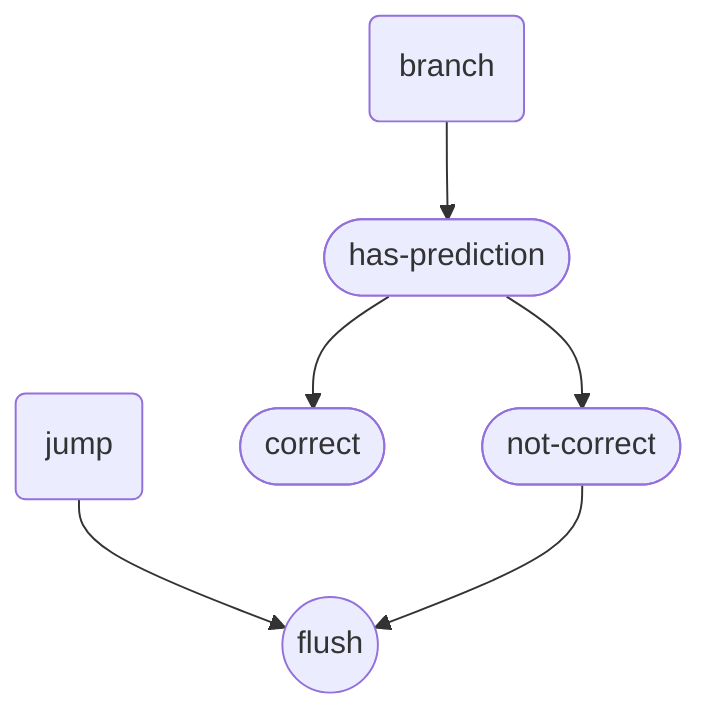
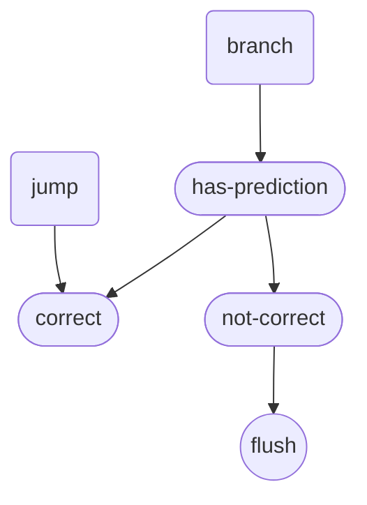
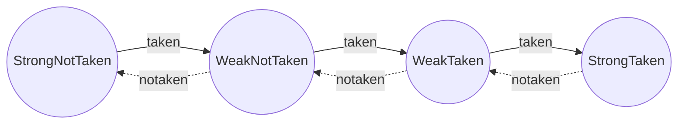

# 1. data hazards
Data hazards occur in pipelined processors when instructions that are close together in the instruction stream (program order) depend on each other and their execution overlaps 
in the pipeline. There are three types of data hazards:

Read After Write (RAW): Also known as a true dependency, occurs when an instruction needs to read a register that a previous instruction is writing to.
Write After Read (WAR): Occurs when an instruction needs to write to a register that a previous instruction is reading from.
Write After Write (WAW): Occurs when two instructions are writing to the same register, and the order of writes must be preserved.

Example of a RAW Hazard
Consider the following sequence of instructions:
Assembly
1. ADD R1, R2, R3   # R1 = R2 + R3
2. SUB R4, R1, R5   # R4 = R1 - R5
The SUB instruction needs the result of the ADD instruction. If the ADD instruction has not completed its write-back stage before the SUB instruction reads R1, a RAW hazard occurs.

Handling Data Hazards
To handle data hazards, several techniques can be used:

Stalling: Pausing the pipeline until the hazard is resolved.
Forwarding (Bypassing): Passing the result directly from one pipeline stage to another without going through the register file.
Reordering Instructions: Changing the order of instructions to avoid the hazard.

## 1.1. forward
detect : rd (EX_MEM_rd or MEM_WB_rd) is the src of ALU-A or ALU-B 
handle : add mux before ALU-A & ALU-B, get a forward path from  EX_MEM_rd or MEM_WB_rd

## 1.2. stall
some case of data-hazard can't be handle by forward 

**load-use hazard**
A load-use hazard occurs when an instruction needs to use a value that is currently being loaded from memory by a preceding instruction. This is a type of data hazard that happens because the data required by the subsequent instruction is not yet available.

the src is memory not register(rd) ,so it can by forward 

```s
lw   x1, 0(x2)   // Load the value from memory at address in x2 into register x1
add  x3, x1, x4  // Add the value in x1 to the value in x4 and store the result in x3
```

```v
    // Load-use hazard detection
    if (EX_MEM_MemRead && (EX_MEM_Rd != 0) && 
        ((EX_MEM_Rd == ID_EX_Rs1) || (EX_MEM_Rd == ID_EX_Rs2))) begin
        // Stall due to load-use hazard
        hazard_stall <= 1'b1;
    end
```

In a pipelined processor, when a stall is detected in the EX stage (or any other stage), you generally need to stall the pipeline stages before (**upstream**) the stage where the hazard is detected. The stages after (**downstream**) the detected hazard should continue executing normally.

**src of stall （maybe or not）**:
- hazard_stall (data-path)
  - stall upstream stage, let downstream stage go; 
- i-cache-miss, 
    - just wait until I-valid, no need to stall 
- d-cache-miss, load-usd
    - stall if/if/ex stage until D-valid
- debug, halt for step or breakpoint 

### 1.2.1. if stall detect in ex stage:
IF/ID Stage:
- When hazard_stall is asserted, the IF/ID register should hold its current value (stall), preventing new instructions from being fetched and decoded.

EX Stage:
- Insert a NOP (no-operation) instruction in the EX stage to prevent the instruction causing the hazard from progressing until the hazard is resolved.

MEM/WB Stages:
- Continue executing normally, as they are downstream from the hazard.

### 1.2.2. if stall detect in mem stage:
When a hazard stall occurs in the MEM stage, you need to ensure that the pipeline handles this appropriately. Typically, you would want to ensure that the stages upstream (IF, ID, and EX) are aware of the stall and handle it correctly. However, the specific actions you take can depend on the design of your pipeline and how you handle stalls.

Actions to Take for MEM Stage Hazard Stall
Stall the Pipeline:
You should stall the IF, ID, and EX stages to prevent new instructions from entering the pipeline until the hazard is resolved.

Insert NOPs:
Insert NOPs (no-operation instructions) into the MEM stage to hold the current instruction.

# 2. control hazards

Handling control hazards in a pipelined RISC-V core involves managing the uncertainties that arise from branch instructions. 
These hazards can be resolved using various techniques such as stalling, branch prediction, and delayed branching. Here are the common methods to handle control hazards:

1. Stalling (Bubble Insertion):
    Introduce NOPs (No Operation) into the pipeline until the branch decision is resolved.
    This is a simple but not very efficient method.
2. Branch Prediction:
    Predict the outcome of a branch (taken or not taken) and continue executing instructions based on the prediction.
    If the prediction is incorrect, flush the incorrect instructions and fetch the correct ones.
    There are different branch prediction strategies, such as static prediction (always predict taken or not taken) and dynamic prediction (using hardware like branch history tables).
3. Delayed Branching:
    Execute a fixed number of instructions following a branch instruction regardless of whether the branch is taken or not.
    This requires careful scheduling of instructions by the compiler.
4. Branch Target Buffer (BTB):
    A hardware mechanism that stores the target addresses of recently executed branch instructions.
    Helps in quickly determining the next instruction to fetch if a branch is predicted taken.
    Implementing Control Hazard Handling

## 2.1. branch or jump prediction

### 2.1.1. total solution


### 2.1.2. no prediction



### 2.1.3. add prediction to branch



### 2.1.4. add prediction to jump too;



基本思想
分支预测器 (BPU) 放在 IF 阶段：
在 IF 阶段，根据当前 PC 进行分支预测。
如果预测分支将被采取，则使用预测的目标地址进行下一条指令的获取。

分支目标地址计算在 EX 阶段：
在 EX 阶段，实际计算分支目标地址。
通过比较预测结果和实际分支结果，决定是否需要刷新流水线。

具体实现步骤
在 IF 阶段进行分支预测并获取指令：

使用分支预测器预测分支是否被采取。
如果预测分支被采取，则 PC 设置为预测的目标地址。否则，PC 继续按顺序增加。

在 EX 阶段计算实际的分支目标地址并验证预测：
计算实际的分支目标地址。
比较分支预测结果和实际结果。如果不一致，则刷新流水线并更新 PC。

### 2.1.5. BranchPredictionUnit： 
- 没有，也不影响正常流程；仅仅是提高了预测的正确性
- 独立工作，给出预测输出/接受预测正确与否的反馈
- 原理： 概率的马尔科夫链



### flush
在处理分支预测错误时，通常需要清除（flush）流水线中的某些阶段，以确保错误的指令不会被执行。
你提到的情况确实是这样，IF 和 ID 阶段属于 EXE 阶段的上游，因此需要清除这些阶段的内容。
但 EXE 阶段是否需要清除取决于具体的实现和系统设计。
通常情况下，MEM 和 WB 阶段是下游阶段，不需要清除。

具体情况分析
1. IF 和 ID 阶段：
由于分支预测错误，IF 和 ID 阶段的指令是基于错误的预测获取的，因此需要清除这些阶段的指令，以避免错误的指令被执行。

2. EXE 阶段：
EXE 阶段正在执行的指令通常是正确的，除非分支预测错误的指令影响了当前正在执行的指令。在这种情况下，可能需要清除 EXE 阶段。
如果 EXE 阶段的指令不受分支预测错误的影响，则不需要清除。

在处理分支预测错误时，清除（flush）EX阶段的内容是更稳妥的做法。
虽然在某些情况下，不清除EX阶段也不会产生问题，但清除EX阶段可以确保流水线中的所有指令都是正确的，并且不会出现任何额外的问题。

为什么清除EX阶段更稳妥？
确保数据一致性：清除EX阶段可以保证在分支预测错误后，流水线中的数据和状态是一致的，不会执行错误的指令。
减少复杂性：清除EX阶段可以简化控制逻辑，避免在特殊情况下需要处理复杂的依赖关系或数据转发问题。
提高可靠性：清除EX阶段可以提高系统的可靠性，确保在所有情况下，流水线中的指令都是正确的，不会产生意外的行为。

3. MEM 和 WB 阶段：
这两个阶段是下游阶段，通常不需要清除，因为它们正在处理的是已经执行过的指令的结果，而这些指令应该是正确的。


## 2.2. update for PCs (prediction to both jump & branch)

### 2.2.1. if-stage
**pc** : internal signal of if stage

$$
pc = 
\begin{cases}
\ 0, & reset \\
\ pc + 4, &normal-inst &or &branch-predict-not-taken\\
\ pc + immd, &branch(predict-taken)\\
\ immd, & jump(always-taken) \\
\ next\_pc, & flush
\end{cases}
$$

### 2.2.2. ex-stage:
**next_pc**: output for re-set the pc after flush.
$$
next\_pc = 
\begin{cases}
\ 0, & reset \\
\ ID\_EX\_PC + 4, & IF\_ID\_branch\_taken==1 &but,  &branch\_teken == 0\\
\ ID\_EX\_PC + ID\_EX\_immd, &IF\_ID\_branch\_taken==0 &but,  &branch\_teken == 1\\
\end{cases}
$$

### 2.2.3. Q/A
> is next_pc need to transfer to mem or wb stage ?
> i think no;


