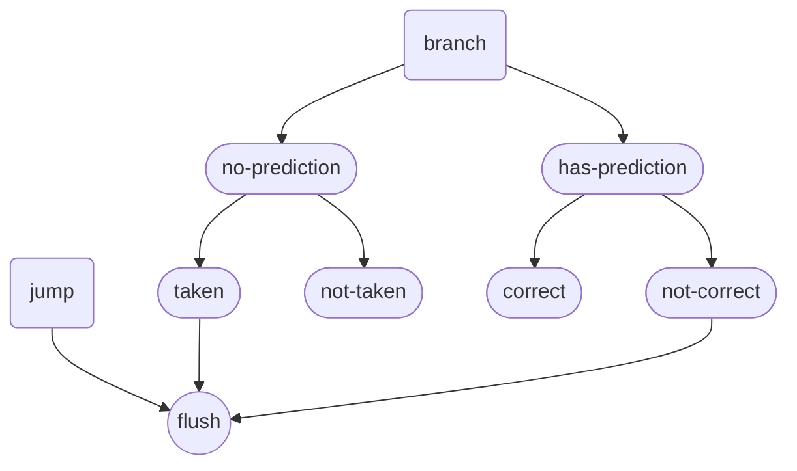

# 1. data hazards
Data hazards occur in pipelined processors when instructions that are close together in the instruction stream (program order) depend on each other and their execution overlaps 
in the pipeline. There are three types of data hazards:

Read After Write (RAW): Also known as a true dependency, occurs when an instruction needs to read a register that a previous instruction is writing to.
Write After Read (WAR): Occurs when an instruction needs to write to a register that a previous instruction is reading from.
Write After Write (WAW): Occurs when two instructions are writing to the same register, and the order of writes must be preserved.

Example of a RAW Hazard
Consider the following sequence of instructions:
Assembly
1. ADD R1, R2, R3   # R1 = R2 + R3
2. SUB R4, R1, R5   # R4 = R1 - R5
The SUB instruction needs the result of the ADD instruction. If the ADD instruction has not completed its write-back stage before the SUB instruction reads R1, a RAW hazard occurs.

Handling Data Hazards
To handle data hazards, several techniques can be used:

Stalling: Pausing the pipeline until the hazard is resolved.
Forwarding (Bypassing): Passing the result directly from one pipeline stage to another without going through the register file.
Reordering Instructions: Changing the order of instructions to avoid the hazard.

## 1.1. forward

detect
handle : add mux input for alu-A & alu-b

## 1.2. stall
In a pipelined processor, when a stall is detected in the EX stage (or any other stage), you generally need to stall the pipeline stages before (**upstream**) the stage where the hazard is detected. The stages after (**downstream**) the detected hazard should continue executing normally.

### 1.2.1. if stall detect in ex stage:
IF/ID Stage:
- When hazard_stall is asserted, the IF/ID register should hold its current value (stall), preventing new instructions from being fetched and decoded.

EX Stage:
- Insert a NOP (no-operation) instruction in the EX stage to prevent the instruction causing the hazard from progressing until the hazard is resolved.

MEM/WB Stages:
- Continue executing normally, as they are downstream from the hazard.

### 1.2.2. if stall detect in mem stage:
When a hazard stall occurs in the MEM stage, you need to ensure that the pipeline handles this appropriately. Typically, you would want to ensure that the stages upstream (IF, ID, and EX) are aware of the stall and handle it correctly. However, the specific actions you take can depend on the design of your pipeline and how you handle stalls.

Actions to Take for MEM Stage Hazard Stall
Stall the Pipeline:
You should stall the IF, ID, and EX stages to prevent new instructions from entering the pipeline until the hazard is resolved.

Insert NOPs:
Insert NOPs (no-operation instructions) into the MEM stage to hold the current instruction.

# 2. control hazards

Handling control hazards in a pipelined RISC-V core involves managing the uncertainties that arise from branch instructions. 
These hazards can be resolved using various techniques such as stalling, branch prediction, and delayed branching. Here are the common methods to handle control hazards:

1. Stalling (Bubble Insertion):
    Introduce NOPs (No Operation) into the pipeline until the branch decision is resolved.
    This is a simple but not very efficient method.
2. Branch Prediction:
    Predict the outcome of a branch (taken or not taken) and continue executing instructions based on the prediction.
    If the prediction is incorrect, flush the incorrect instructions and fetch the correct ones.
    There are different branch prediction strategies, such as static prediction (always predict taken or not taken) and dynamic prediction (using hardware like branch history tables).
3. Delayed Branching:
    Execute a fixed number of instructions following a branch instruction regardless of whether the branch is taken or not.
    This requires careful scheduling of instructions by the compiler.
4. Branch Target Buffer (BTB):
    A hardware mechanism that stores the target addresses of recently executed branch instructions.
    Helps in quickly determining the next instruction to fetch if a branch is predicted taken.
    Implementing Control Hazard Handling

## 2.1. branch & jump & flush

基本思想
分支预测器 (BPU) 放在 IF 阶段：
在 IF 阶段，根据当前 PC 进行分支预测。
如果预测分支将被采取，则使用预测的目标地址进行下一条指令的获取。

分支目标地址计算在 EX 阶段：
在 EX 阶段，实际计算分支目标地址。
通过比较预测结果和实际分支结果，决定是否需要刷新流水线。

具体实现步骤
在 IF 阶段进行分支预测并获取指令：
使用分支预测器预测分支是否被采取。
如果预测分支被采取，则 PC 设置为预测的目标地址。否则，PC 继续按顺序增加。

在 EX 阶段计算实际的分支目标地址并验证预测：
计算实际的分支目标地址。
比较分支预测结果和实际结果。如果不一致，则刷新流水线并更新 PC。
