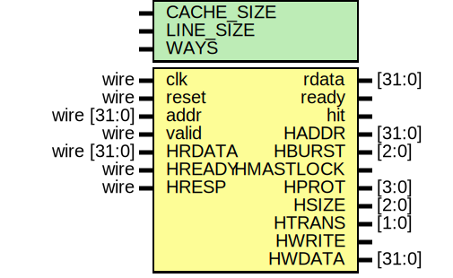
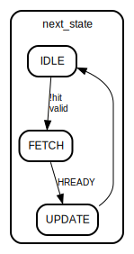

# Entity: ICache 
- **File**: i-cache.v

## Diagram

## Generics

| Generic name | Type | Value | Description |
| ------------ | ---- | ----- | ----------- |
| CACHE_SIZE   |      | 1024  |             |
| LINE_SIZE    |      | 64    |             |
| WAYS         |      | 1     |             |

## Ports

| Port name | Direction | Type        | Description |
| --------- | --------- | ----------- | ----------- |
| clk       | input     | wire        |             |
| reset     | input     | wire        |             |
| addr      | input     | wire [31:0] |             |
| valid     | input     | wire        |             |
| rdata     | output    | [31:0]      |             |
| ready     | output    |             |             |
| hit       | output    |             |             |
| HADDR     | output    | [31:0]      |             |
| HBURST    | output    | [2:0]       |             |
| HMASTLOCK | output    |             |             |
| HPROT     | output    | [3:0]       |             |
| HSIZE     | output    | [2:0]       |             |
| HTRANS    | output    | [1:0]       |             |
| HWRITE    | output    |             |             |
| HWDATA    | output    | [31:0]      |             |
| HRDATA    | input     | wire [31:0] |             |
| HREADY    | input     | wire        |             |
| HRESP     | input     | wire        |             |

## Signals

| Name                                                     | Type                   | Description |
| -------------------------------------------------------- | ---------------------- | ----------- |
| cache_data [0:NUM_LINES-1][0:WAYS-1][0:LINE_SIZE/4-1]    | reg [31:0]             |             |
| cache_tags [0:NUM_LINES-1][0:WAYS-1]                     | reg [TAG_BITS-1:0]     |             |
| cache_valid [0:NUM_LINES-1][0:WAYS-1]                    | reg                    |             |
| index = addr[OFFSET_BITS + INDEX_BITS - 1 : OFFSET_BITS] | wire [INDEX_BITS-1:0]  |             |
| tag = addr[31 : 32 - TAG_BITS]                           | wire [TAG_BITS-1:0]    |             |
| offset = addr[OFFSET_BITS-1:0]                           | wire [OFFSET_BITS-1:0] |             |
| way                                                      | integer                |             |
| state                                                    | reg [1:0]              |             |
| next_state                                               | reg [1:0]              |             |

## Constants

| Name        | Type | Value                           | Description |
| ----------- | ---- | ------------------------------- | ----------- |
| NUM_LINES   |      | CACHE_SIZE / (LINE_SIZE * WAYS) |             |
| INDEX_BITS  |      | (NUM_LINES)                     |             |
| OFFSET_BITS |      | (LINE_SIZE)                     |             |
| TAG_BITS    |      | 32 - INDEX_BITS - OFFSET_BITS   |             |
| IDLE        |      | 2'b00                           |             |
| FETCH       |      | 2'b01                           |             |
| UPDATE      |      | 2'b10                           |             |

## Processes
- unnamed: ( @(posedge clk or posedge reset) )
  - **Type:** always
- unnamed: ( @(*) )
  - **Type:** always

## State machines

